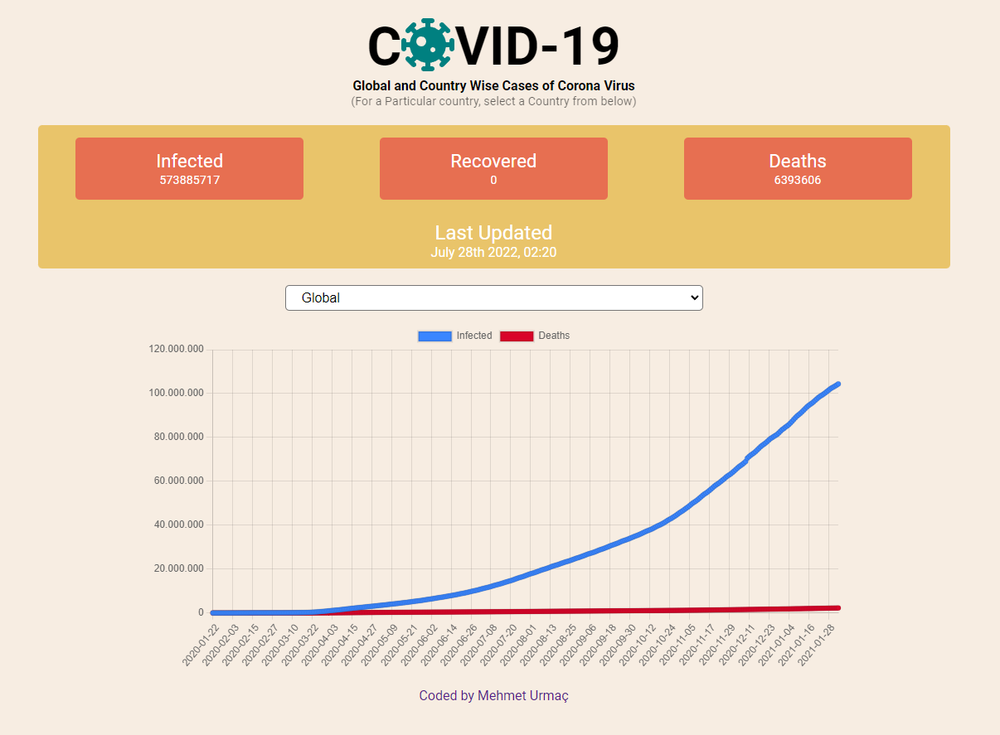
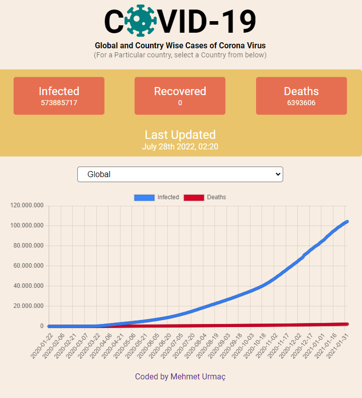
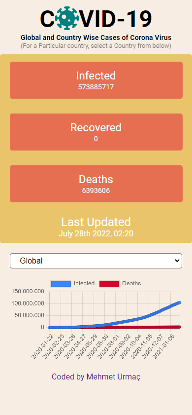

# Covid19 Tracker

> https://covid-tracker-mu.netlify.app/

## API and Modules Used

- [mathdro.id/api](https://covid19.mathdro.id/api)

- [fortawesome](https://fortawesome.com/)

- [chart.js](https://www.npmjs.com/package/chart.js)

- [axios](https://www.npmjs.com/package/axios)

- [moment](https://www.npmjs.com/package/moment)

## Responsive

